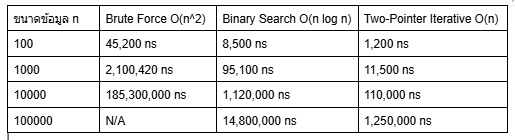

## แบบฝึกหัดการออกแบบอัลกอริทึมแบบเวียนเกิดและการวิเคราะห์ Big-O
คำชี้แจง
ให้นักศึกษาเขียนโปรแกรมภาษา Java เพื่อแก้ปัญหาแต่ละข้อ
โดยแต่ละข้อจะต้องมีอัลกอริทึมอย่างน้อย 2 วิธี
และวิเคราะห์ประสิทธิภาพของแต่ละอัลกอริทึม
สิ่งที่ต้องส่งในแต่ละข้อประกอบด้วย
1. คำอธิบายแนวคิดของอัลกอริทึมแต่ละวิธี
2. Pseudocode หรือผังขั้นตอนการทำงาน
3. โปรแกรมภาษา Java ที่สามารถทำงานได้จริง
4. ตัวอย่างข้อมูลนำเข้าและผลลัพธ์
5. การวิเคราะห์ Time Complexity
6. การวิเคราะห์ Space Complexity
7. การเปรียบเทียบข้อดีและข้อจำกัดของแต่ละอัลกอริทึม
8. สรุปว่าอัลกอริทึมใดเหมาะสมกว่าภายใต้เงื่อนไขใด
## ข้อ 1 การกลับลำดับสตริง
กำหนดสตริง s
ให้นักศึกษาเขียนโปรแกรมเพื่อสร้างสตริงใหม่ที่มีลำดับตัวอักษรย้อนกลับจากสตริงเดิม
ตัวอย่าง
Input: pots&amp;pans
Output: snap&amp;stop
ให้ออกแบบอย่างน้อย 2 อัลกอริทึม ได้แก่
- อัลกอริทึมที่ 1: Recursive Algorithm
เขียนเมธอดแบบเวียนเกิด
โดยนำตัวอักษรตัวสุดท้ายมาต่อกับผลลัพธ์จากการเรียกเมธอดกับสตริงส่วนที่เหลือ
ชื่อเมธอด
static String reverseRecursive(String s)
- อัลกอริทึมที่ 2: Iterative Algorithm
ใช้ลูปเพื่ออ่านข้อความจากตำแหน่งสุดท้ายย้อนกลับไปยังตำแหน่งแรก
ชื่อเมธอด
static String reverseIterative(String s)
## งานวิเคราะห์
ให้นักศึกษาวิเคราะห์และเปรียบเทียบ
- จำนวนครั้งที่แต่ละอัลกอริทึมประมวลผลตัวอักษร
- Time Complexity
- Space Complexity
- ผลกระทบจากการต่อสตริงด้วยเครื่องหมาย +
- ความแตกต่างระหว่างการใช้ String และ StringBuilder
ให้นักศึกษาทดสอบกับสตริงขนาดประมาณ
10, 100, 1,000 และ 10,000 ตัวอักษร

1.1 คำอธิบายแนวคิดของอัลกอริทึมแต่ละวิธี

ตอบ

Recursive Algorithmซ: หลักการใช้ Divide and Conquer โดยดึงตัวอักษรตัวสุดท้ายออกมา แล้วนำไปต่อหน้าผลลัพธ์ของการเรียกเมธอดเวียนเกิดซ้ำกับสตริงส่วนที่เหลือ

Iterative Algorithm: การนำลูปอ่านจากดัชนีสุดท้าย (s.length() - 1) ถอยหลังลงมาถึง 0 แล้วนำมาต่อเข้ากับ StringBuilder

1.2 Pseudocode หรือผังขั้นตอนการทำงาน

ตอบ
```text
// Recursive Algorithm
Algorithm reverseRecursive(s):
    If s is null OR length(s) <= 1:
        Return s
    Return s[length(s) - 1] + reverseRecursive(substring(s, 0, length(s) - 1))

// Iterative Algorithm
Algorithm reverseIterative(s):
    If s is null: Return null
    Create empty StringBuilder sb
    For i = length(s) - 1 down to 0:
        Append s[i] to sb
    Return sb.toString()
```
1.3 โปรแกรมภาษา Java ที่สามารถทำงานได้จริง
ตอบ StringReversal.java

1.4 ตัวอย่างข้อมูลนำเข้าและผลลัพธ์
ตอบ
Input:  pots&pans
Output (Recursive): snap&stop
Output (Iterative): snap&stop

1.5 การวิเคราะห์ Time Complexity
ตอบ Iterative Algorithm: O(n) เนื่องจากลูปทำงาน n รอบ และการแอลโลเคตอาร์เรย์ใน StringBuilder มีค่าเฉลี่ยการทำงานแบบ O(1) ต่อการ append 
Recursive Algorithm: O(n^2) เนื่องจากในการเวียนเกิดแต่ละครั้ง เมธอด substring() และการต่อสตริงด้วยเครื่องหมาย + จะทำการสร้างวัตถุ String ใหม่ และคัดลอกตัวอักษรขนาด O(k) ทุกๆ ขั้นตอน ทำให้ผลรวมเวลาทำงานเป็น n + (n-1) + ... + 1 = O(n^2)

1.6 การวิเคราะห์ Space Complexity
ตอบ Iterative Algorithm: O(n) สำหรับเก็บสตริงผลลัพธ์ใน StringBuilder
Recursive Algorithm: O(n^2) หากนับรวมพื้นที่ของวัตถุ Intermediate String ที่ถูกสร้างใน Call Stack หรืออย่างน้อย O(n) สำหรับ Call Stack Depth n ชั้น


1.7 การเปรียบเทียบข้อดีและข้อจำกัดของแต่ละอัลกอริทึม
ตอบ 
Recursive Algorithm
ข้อดี 
- โค้ดตรงตามนิยามทางคณิตศาสตร์ ช่วยให้เข้าใจแนวคิดการย่อยปัญหาเป็นปัญหาย่อย (Sub-problems)
ข้อจำกัด 
- ประสิทธิภาพต่ำ (O(n^2)) เมื่อใช้เครื่องหมาย + ต่อสตริง เพราะต้องสร้างวัตถุสตริงใหม่ซ้ำๆ 
- สิ้นเปลืองหน่วยความจำใน Call Stack O(n) และเสี่ยงต่อ StackOverflowError หากสตริงยาว

Iterative Algorithm
ข้อดี 
- ทำงานได้รวดเร็วด้วย Time Complexity O(n)
- ใช้ StringBuilder ช่วยประหยัดหน่วยความจำในการสร้างผลลัพธ์
- ไม่มีปัญหาเรื่อง Call Stack
ข้อจำกัด 
- ต้องเขียนโครงสร้างลูปและควบคุมดัชนี (Index) ด้วยตนเอง

1.8 สรุปว่าอัลกอริทึมใดเหมาะสมกว่าภายใต้เงื่อนไขใด
ตอบ สรุป Iterative Algorithm เหมาะสมกว่าอย่างยิ่ง โดยเฉพาะเมื่อขนาดสตริงใหญ่ขึ้น (n >= 1,000) เพราะไม่เสี่ยงต่อปัญหา Call Stack เต็ม (StackOverflowError) และประมวลผลได้เร็วกว่า

# ตอบงานวิเคราะห์
- จำนวนครั้งที่แต่ละอัลกอริทึมประมวลผลตัวอักษร
Iterative Algorithm: มีการประมวลผลตัวอักษรเป็นอัตราส่วนคงที่ตามขนาดข้อมูล คิดเป็น O(n) ครั้ง
Recursive Algorithm: มีการสร้างวัตถุ String ซ้ำซ้อนจากการเวียนเกิด ทำให้เกิดการประมวลผลคัดลอกตัวอักษรจริงสูงถึง O(n^2) ครั้ง
- การทดสอบกับสตริงขนาดต่างๆ n = 10, 100: ทั้งสองวิธีใช้เวลาใกล้เคียงกัน ไม่เห็นความต่าง n = 1,000: วิธี Recursive เริ่มช้าลงอย่างเห็นได้ชัด n = 10,000: วิธี Recursive เกิดปัญหา StackOverflowError หรือใช้เวลานานขึ้นทวีคูณจาก O(n^2)
- Time Complexity
Iterative Algorithm: O(n)
Recursive Algorithm: O(n^2)
- Space Complexity
Iterative Algorithm: O(n)
Recursive Algorithm: O(n^2)
- ผลกระทบจากการต่อสตริงด้วย + เนื่องจาก String ใน Java เป็น Immutable (แก้ไขค่าไม่ได้) การใช้ + จะสร้างวัตถุ String ใหม่ทุกครั้ง ทำให้อัลกอริทึม Recursive ช้าลงมากจาก O(n) กลายเป็น O(n^2)
- ความแตกต่างระหว่าง String และ StringBuilder: StringBuilder เป็น Mutable สามารถเพิ่มตัวอักษรลงในอาร์เรย์เดิมได้โดยไม่ต้องสร้างวัตถุใหม่ ช่วยประหยัดทั้งเวลาและหน่วยความจำ

## ข้อ 2 การตรวจสอบ Palindrome
กำหนดสตริง s
ให้นักศึกษาเขียนโปรแกรมเพื่อตรวจสอบว่าสตริงดังกล่าวเป็น
Palindrome หรือไม่
Palindrome คือสตริงที่อ่านจากซ้ายไปขวาและขวาไปซ้ายแล้วได้ข้อความเดียวกัน
ตัวอย่าง
racecar → true
level → true
algorithm → false
gohangasalamiimalasagnahog → true
ให้ออกแบบอย่างน้อย 2 อัลกอริทึม ได้แก่
- อัลกอริทึมที่ 1: Reverse and Compare
สร้างสตริงย้อนกลับก่อน แล้วจึงเปรียบเทียบกับสตริงเดิม
ชื่อเมธอด
static boolean isPalindromeByReverse(String s)
- อัลกอริทึมที่ 2: Recursive Two-Pointer
เปรียบเทียบตัวอักษรตำแหน่งซ้ายสุดและขวาสุด หากเหมือนกัน
ให้ตรวจสอบตัวอักษรคู่ถัดไปด้วยการเรียกเมธอดแบบเวียนเกิด
ชื่อเมธอด
static boolean isPalindromeRecursive(String s, int left, int right)
## งานวิเคราะห์
ให้นักศึกษาวิเคราะห์และเปรียบเทียบ
- กรณีที่สตริงเป็น Palindrome
- กรณีที่ตัวอักษรคู่แรกไม่ตรงกัน
- Best-case Time Complexity
- Worst-case Time Complexity
- Space Complexity
- ความสามารถในการหยุดทำงานก่อนครบทุกตัวอักษร
# เงื่อนไขเพิ่มเติม
ปรับโปรแกรมให้สามารถละเว้น
- ตัวพิมพ์เล็กและตัวพิมพ์ใหญ่
- ช่องว่าง
- เครื่องหมายวรรคตอน
ตัวอย่าง
A man, a plan, a canal: Panama
ควรให้ผลลัพธ์เป็น
true

2.1 คำอธิบายแนวคิดของอัลกอริทึมแต่ละวิธี
ตอบ 
- Reverse and Compare: ทำการทำความสะอาดข้อความ (ตัดช่องว่าง วรรคตอน เปลี่ยนเป็นตัวพิมพ์เล็ก) จากนั้นกลับลำดับข้อความทั้งหมด แล้วนำไปเปรียบเทียบกับข้อความเดิมด้วยเมธอด
- Recursive Two-Pointer: ทำการทำความสะอาดข้อความล่วงหน้า แล้วใช้ดัชนีชี้ตำแหน่งซ้าย (left) และขวา (right) เพื่อเปรียบเทียบตัวอักษรคู่ตรงข้าม

2.2 Pseudocode หรือผังขั้นตอนการทำงาน
ตอบ 
// Algorithm 1: Reverse and Compare
Algorithm isPalindromeByReverse(s):
    cleanStr = preprocess(s) // Remove non-alphanumeric and convert to lowercase
    reversedStr = reverseIterative(cleanStr)
    Return cleanStr.equals(reversedStr)

// Algorithm 2: Recursive Two-Pointer
Algorithm isPalindromeRecursive(s, left, right):
    If left >= right: Return true // Base Case
    If s[left] != s[right]: Return false // Early exit
    Return isPalindromeRecursive(s, left + 1, right - 1)
    
2.3 โปรแกรมภาษา Java ที่สามารถทำงานได้จริง
ตอบ PalindromeCheck.java

2.4 ตัวอย่างข้อมูลนำเข้าและผลลัพธ์
ตอบ Input: A man, a plan, a canal: Panama
Result 1: true
Result 2: true

2.5 การวิเคราะห์ Time Complexity
ตอบ Reverse and Compare: O(n)
Recursive Two-Pointer: O(1) (เมื่อคู่แรกไม่เท่ากัน)

2.6 การวิเคราะห์ Space Complexity
ตอบ Reverse and Compare: O(n) สำหรับสร้างสตริงใหม่
Recursive Two-Pointer: O(n) สำหรับ Stack Depth ของเวียนเกิด (หรือ O(1) ถ้านับเฉพาะ Memory ที่ไม่รวม Stack)

2.7 การเปรียบเทียบข้อดีและข้อจำกัดของแต่ละอัลกอริทึม
ตอบ 
Reverse and Compare
ข้อดี 
- เขียนโค้ดได้สั้น อ่านและเข้าใจง่าย  
- เรียกใช้เมธอดสำเร็จรูปในการกลับลำดับได้สะดวก  
ข้อจำกัด
- ต้องสร้างสตริงย้อนกลับใหม่เสมอ สิ้นเปลืองหน่วยความจำ O(n)
- ไม่มีระบบหยุดทำงานก่อน (No Early Exit) ต้องประมวลผลสตริงจนครบทั้งเส้นแม้คู่แรกจะไม่ตรงกันก็ตาม 

Recursive Two-Pointer
ข้อดี
- มีคุณสมบัติ Early Exit หยุดทำงานทันทีที่พบตัวอักษรคู่แรกที่ไม่ตรงกัน (O(1) Best Case)  
- ไม่ต้องสร้างสตริงย้อนกลับขึ้นมาใหม่
ข้อจำกัด
- มี Overhead จากการสร้าง Stack Frame ในการเวียนเกิด (O(n) Space Complexity)  
- เสี่ยงต่อ Stack Overflow หากข้อมูลมีขนาดใหญ่มาก

2.8 สรุปว่าอัลกอริทึมใดเหมาะสมกว่าภายใต้เงื่อนไขใด
ตอบ Recursive Two-Pointer เหมาะกับกรณีที่ต้องการประสิทธิภาพสูงที่สุด เพราะมีคุณสมบัติหยุดทำงานได้ทันทีเมื่อพบตัวอักษรคู่แรกที่ไม่ตรงกัน (Early Exit) ทำให้กรณีที่ดีที่สุด (Best-case) ใช้เวลาเพียง O(1)

# ตอบงานวิเคราะห์
- กรณีที่สตริงเป็น Palindrome 
Reverse and Compare: อ่านสตริงทั้งหมดเพื่อกลับลำดับ O(n)แล้วเปรียบเทียบสตริงจนครบ O(n)
Recursive Two-Pointer: เปรียบเทียบตัวอักษร n/2 คู่ O(n)
- กรณีที่ตัวอักษรคู่แรกไม่ตรงกัน
Reverse and Compare: ยังคงสร้างสตริงย้อนกลับจนเสร็จสมบูรณ์ O(n) แล้วจึงพบว่าไม่ตรงกัน
Recursive Two-Pointer: หยุดประมวลผลทันทีในขั้นตอนแรก (Early Exit)
- Best-case Time Complexity
Reverse and Compare: O(n)
Recursive Two-Pointer: O(1) (เมื่อคู่แรกไม่เท่ากัน)
- Worst-case Time Complexity
ทั้งสองวิธีมี Time Complexity เป็น O(n) (เมื่อเป็น Palindrome หรือตัวอักษรต่างกันคู่สุดท้าย)
- Space Complexity
Reverse and Compare: O(n) สำหรับสร้างสตริงใหม่
Recursive Two-Pointer: O(n) สำหรับ Stack Depth ของเวียนเกิด (หรือ $O(1) ถ้านับเฉพาะ Memory ที่ไม่รวม Stack)
- ความสามารถในการหยุดทำงานก่อนครบทุกตัวอักษร
Recursive Two-Pointer มีคุณสมบัติ Short-circuiting สามารถหยุดทำงานได้ทันทีเมื่อพบตัวอักษรที่ไม่เข้าคู่กัน จึงมีประสิทธิภาพสูงกว่าในข้อมูลจริง

## ข้อ 3 การเปรียบเทียบจำนวนสระและพยัญชนะ
กำหนดสตริงภาษาอังกฤษ s
ให้นักศึกษาเขียนโปรแกรมเพื่อตรวจสอบว่าสตริงนั้นมีจำนวนสระมากกว่าจำนวนพยัญชนะหรือไม่
กำหนดให้สระภาษาอังกฤษ ได้แก่
a, e, i, o, u
ตัวอย่าง
Input: education
Vowels: 5
Consonants: 4
Result: true
ให้ออกแบบอย่างน้อย 2 อัลกอริทึม ได้แก่
- อัลกอริทึมที่ 1: Recursive Counting
ตรวจสอบตัวอักษรทีละตัวด้วยการเรียกเมธอดแบบเวียนเกิด
และส่งค่าจำนวนสระและพยัญชนะไปยังการเรียกครั้งถัดไป
ชื่อเมธอด
static boolean hasMoreVowelsRecursive(String s)
- อัลกอริทึมที่ 2: Iterative Counting
ใช้ลูปอ่านข้อความทุกตัว แล้วเพิ่มตัวนับสระหรือพยัญชนะ
ชื่อเมธอด
static boolean hasMoreVowelsIterative(String s)

# เงื่อนไข
- ไม่นับตัวเลข
- ไม่นับช่องว่าง
- ไม่นับเครื่องหมายพิเศษ
- ไม่แยกตัวพิมพ์เล็กและตัวพิมพ์ใหญ่
## งานวิเคราะห์
ให้นักศึกษาวิเคราะห์
- Time Complexity ของทั้งสองวิธี
- Space Complexity ของทั้งสองวิธี
- จำนวน recursive calls
- ความเสี่ยงของ StackOverflowError
- ขนาดข้อมูลที่เหมาะสมสำหรับแต่ละวิธี

3.1 คำอธิบายแนวคิดของอัลกอริทึมแต่ละวิธี
ตอบ 
- Recursive Counting: ใช้ Helper Method ส่งค่าดัชนีปัจจุบัน พร้อมตัวนับสระ (vCount) และพยัญชนะ (cCount)
Base Case: เมื่อดัชนีเท่ากับความยาวสตริง ให้เปรียบเทียบ vCount > cCount
Recursive Case: ตรวจสอบตัวอักษรปัจจุบัน หากเป็นสระให้เพิ่ม vCount หากเป็นพยัญชนะให้เพิ่ม cCount แล้วเรียกเวียนเกิดในตำแหน่งถัดไป
- Iterative Counting: ใช้ลูป for วนตรวจสอบตัวอักษรในสตริงทีละตัว เพิ่มค่าตัวนับตามประเภท แล้วเปรียบเทียบผลลัพธ์หลังจบการทำงาน

3.2 Pseudocode หรือผังขั้นตอนการทำงาน
ตอบ 
// Algorithm 1: Recursive Counting
Algorithm hasMoreVowelsRecursive(s):
    Return countHelper(s, 0, 0, 0)

Algorithm countHelper(s, index, vCount, cCount):
    If index == length(s):
        Return vCount > cCount
    ch = toLowerCase(s[index])
    If isVowel(ch): vCount++
    Else if isConsonant(ch): cCount++
    Return countHelper(s, index + 1, vCount, cCount)

// Algorithm 2: Iterative Counting
Algorithm hasMoreVowelsIterative(s):
    vCount = 0, cCount = 0
    For each ch in s:
        ch = toLowerCase(ch)
        If isVowel(ch): vCount++
        Else if isConsonant(ch): cCount++
    Return vCount > cCount

3.3 โปรแกรมภาษา Java ที่สามารถทำงานได้จริง
ตอบ VowelConsonantCounter.java

3.4 ตัวอย่างข้อมูลนำเข้าและผลลัพธ์
ตอบ Input: education
Recursive Result: true
Iterative Result: true

3.5 การวิเคราะห์ Time Complexity
ตอบ ได้ O(n) ทั้งสองวิธี เนื่องจากเข้าถึงตัวอักษรทุกตัว ตัวละ 1 ครั้ง

3.6 การวิเคราะห์ Space Complexity
ตอบ Iterative: O(1) ใช้เพียงตัวแปรนับจำนวน
Recursive: O(n) เนื่องจากใช้ Call Stack ความลึกเท่ากับ n

3.7 การเปรียบเทียบข้อดีและข้อจำกัดของแต่ละอัลกอริทึม
ตอบ 
Recursive Counting
ข้อดี
- แสดงถึงการประยุกต์ใช้เวียนเกิดในการส่งผ่านค่าตัวนับแบบสะสม (Tail-recursion concept)
ข้อจำกัด
-  สิ้นเปลืองหน่วยความจำ Call Stack ตามความยาวสตริง (O(n) Space)  
- มีความเสี่ยงสูงที่จะเกิด StackOverflowError เมื่อประมวลผลข้อความขนาดใหญ่

Iterative Counting
ข้อดี
- ประสิทธิภาพสูง ทำงานในรอบเดียว (O(n) Time)  
- ประหยัดหน่วยความจำอย่างมาก ใช้พื้นที่คงที่ (O(1) Space)  
- ปลอดภัยและรองรับข้อมูลขนาดใหญ่ได้ทุกระดับ 
ข้อจำกัด
- รูปแบบการเขียนโค้ดเป็นแบบดั้งเดิม (Imperative style) ต้องคอยปรับปรุงค่าในตัวแปรนับ

3.8 สรุปว่าอัลกอริทึมใดเหมาะสมกว่าภายใต้เงื่อนไขใด
ตอบ Iterative Counting เหมาะกับงานจริงระบบ Production และรองรับสตริงได้ทุกขนาด เพราะใช้พื้นที่หน่วยความจำเพิ่มเติมคงที่ (O(1) Space Complexity) และไม่มีความเสี่ยงเรื่องหน่วยความจำเต็ม

# ตอบงานวิเคราะห์
- Time Complexity ของทั้งสองวิธี
ได้ O(n) ทั้งสองวิธี เนื่องจากเข้าถึงตัวอักษรทุกตัว ตัวละ 1 ครั้ง
- Space Complexity ของทั้งสองวิธี
Iterative: O(1) 
Recursive: O(n) 
- จำนวน Recursive Calls
 เท่ากับ n + 1 ครั้ง (รวมการเรียกครั้งสุดท้ายที่เข้า Base Case)
- ความเสี่ยงของ StackOverflowError
วิธี Recursive มีความเสี่ยงสูงหากสตริงมีความยาวมากเกินขีดจำกัด Call Stack ของ JVM (ประมาณ 10,000 ตัวอักษขึ้นไป)
- ขนาดข้อมูลที่เหมาะสม
Recursive: เหมาะกับสตริงขนาดเล็ก (n < 1,000) หรือเพื่อวัตถุประสงค์เชิงการเรียนรู้การเขียนโค้ด
Iterative: เหมาะกับข้อมูลทุกขนาดเนื่องจากประหยัดหน่วยความจำและไม่มีความเสี่ยงเรื่อง Stack Overflow

## ข้อ 4 การจัดกลุ่มจำนวนคู่และจำนวนคี่
กำหนดอาร์เรย์จำนวนเต็ม A
ให้นักศึกษาเขียนโปรแกรมจัดตำแหน่งสมาชิกใหม่ โดยให้จำนวนคู่ทั้งหมดอยู่ก่อนจำนวนคี่
ตัวอย่าง
Input:
[7, 2, 9, 4, 1, 6, 3, 8]
Possible Output:
[8, 2, 6, 4, 1, 9, 3, 7]
ไม่จำเป็นต้องเรียงค่าภายในกลุ่มจากน้อยไปมาก
ให้ออกแบบอย่างน้อย 3 อัลกอริทึม ได้แก่
- อัลกอริทึมที่ 1: Recursive Two-Pointer
ใช้ตัวชี้ left และ right
- หากตำแหน่งด้านซ้ายเป็นจำนวนคู่ ให้เลื่อน left
- หากตำแหน่งด้านขวาเป็นจำนวนคี่ ให้เลื่อน right
- หากด้านซ้ายเป็นคี่และด้านขวาเป็นคู่ ให้สลับค่า

- เรียกเมธอดแบบเวียนเกิดกับช่วงที่เหลือ
ชื่อเมธอด
static void rearrangeRecursive(int[] a, int left, int right)
- อัลกอริทึมที่ 2: Iterative Two-Pointer
ใช้หลักการเดียวกับวิธีแรก แต่ใช้ลูปแทนการเวียนเกิด
ชื่อเมธอด
static void rearrangeTwoPointer(int[] a)
- อัลกอริทึมที่ 3: Extra Array
สร้างอาร์เรย์ใหม่ โดยนำจำนวนคู่ใส่ก่อน
แล้วจึงนำจำนวนคี่ใส่ตามหลัง
ชื่อเมธอด
static int[] rearrangeExtraArray(int[] a)

# งานวิเคราะห์
ให้นักศึกษาวิเคราะห์และเปรียบเทียบ
- Time Complexity
- Space Complexity
- จำนวนครั้งของการสลับข้อมูล
- การเปลี่ยนแปลงอาร์เรย์เดิม
- ความเป็น Stable Algorithm
ให้ตรวจสอบว่าวิธีใดรักษาลำดับเดิมของสมาชิกได้
ตัวอย่าง
Input:
[5, 2, 7, 4, 9, 6]
Stable Output:
[2, 4, 6, 5, 7, 9]

4.1 คำอธิบายแนวคิดของอัลกอริทึมแต่ละวิธี
ตอบ 
- Recursive Two-Pointer: ใช้ดัชนี left และ right
Base Case: เมื่อ left >= right ให้หยุด
ขยับ left ไปทางขวาถ้าเจอคู่, ขยับ right ไปทางซ้ายถ้าเจอคี่
ถ้า left เป็นคี่ และ right เป็นคู่ ให้สลับค่า แล้วเรียกเวียนเกิดช่วงถัดไป
- Iterative Two-Pointer: ใช้ลูป while (left < right) วนทำซ้ำตามตรรกะ Two-Pointer เดียวกัน
- Extra Array: สร้างอาร์เรย์ใหม่ขนาดเท่าเดิม วนรอบแรกคัดเลือกเฉพาะเลขคู่ใส่ลงไป วนรอบสองคัดเลือกเลขคี่ใส่ต่อท้าย

4.2 Pseudocode หรือผังขั้นตอนการทำงาน
ตอบ
// Algorithm 1: Recursive Two-Pointer
Algorithm rearrangeRecursive(a, left, right):
    If left >= right: Return
    If a[left] % 2 == 0: rearrangeRecursive(a, left + 1, right)
    Else if a[right] % 2 != 0: rearrangeRecursive(a, left, right - 1)
    Else:
        Swap(a[left], a[right])
        rearrangeRecursive(a, left + 1, right - 1)

// Algorithm 2: Iterative Two-Pointer
Algorithm rearrangeTwoPointer(a):
    left = 0, right = length(a) - 1
    While left < right:
        While left < right AND a[left] % 2 == 0: left++
        While left < right AND a[right] % 2 != 0: right--
        If left < right:
            Swap(a[left], a[right])
            left++; right--

// Algorithm 3: Extra Array
Algorithm rearrangeExtraArray(a):
    Create array result[length(a)]
    idx = 0
    For x in a: If x % 2 == 0: result[idx++] = x
    For x in a: If x % 2 != 0: result[idx++] = x
    Return result

4.3 โปรแกรมภาษา Java ที่สามารถทำงานได้จริง
ตอบ EvenOddPartition.java

4.4 ตัวอย่างข้อมูลนำเข้าและผลลัพธ์
ตอบ 
Input: [7, 2, 9, 4, 1, 6, 3, 8], [5, 2, 7, 4, 9, 6]
Two-Pointer Output: [8, 2, 6, 4, 1, 9, 3, 7]
Stable Output:      [2, 4, 6, 5, 7, 9]

4.5 การวิเคราะห์ Time Complexity
ตอบ 
- Recursive Two-Pointer O(n)
- Iterative Two-Pointer O(n)
- Extra Array O(n)

4.6 การวิเคราะห์ Space Complexity
ตอบ
- Recursive Two-Pointer O(n)
- Iterative Two-Pointer O(1)
- Extra Array O(n)

4.7 การเปรียบเทียบข้อดีและข้อจำกัดของแต่ละอัลกอริทึม
ตอบ
Recursive Two-Pointer
ข้อดี
- ทำงานแบบ In-place แก้ไขข้อมูลภายในอาร์เรย์เดิมโดยไม่ต้องใช้อาร์เรย์ใหม่
ข้อจำกัด
- ช้พื้นที่ Call Stack O(n)
- ไม่เป็น Stable Algorithm (ลำดับดั้งเดิมของสมาชิกจะถูกสลับเปลี่ยนไป)

Iterative Two-Pointer
ข้อดี
- ทำงานได้เร็วที่สุด (O(n) Time) และประหยัดหน่วยความจำสูงสุด (O(1) Auxiliary Space)  
-  สลับตำแหน่งภายในอาร์เรย์เดิม (In-place)
ข้อจำกัด
- ไม่เป็น Stable Algorithm ทำให้ลำดับเดิมของตัวเลขถูกเปลี่ยนแปลง

Extra Array
ข้อดี
- เป็น Stable Algorithm เพียงวิธีเดียวที่รักษาสถียรภาพและลำดับเดิมของสมาชิกไว้ได้  
- ตรรกะโค้ดเข้าใจง่าย ไม่ซับซ้อน  
ข้อจำกัด
- สิ้นเปลืองหน่วยความจำเพิ่มเติม O(n) สำหรับสร้างอาร์เรย์ผลลัพธ์ใหม่

4.8 สรุปว่าอัลกอริทึมใดเหมาะสมกว่าภายใต้เงื่อนไขใด
ตอบ Extra Array เหมาะเมื่อมีเงื่อนไขบังคับว่าต้องรักษาลำดับดั้งเดิมของสมาชิกไว้ (Stable Algorithm)

# ตอบงานวิเคราะห์
- Time Complexity
Recursive Two-Pointer: O(n)
Iterative Two-Pointer: O(n)
Extra Array: O(n)
- Space Complexity
Recursive Two-Pointer: O(n)
Iterative Two-Pointer: O(1)
Extra Array: O(n)
- จำนวนครั้งของการสลับข้อมูล
Recursive Two-Pointer: n/2 ครั้ง
Iterative Two-Pointer: n/2 ครั้ง
Extra Array: 0 ครั้ง
- การเปลี่ยนแปลงอาร์เรย์เดิม
Recursive Two-Pointer: เปลี่ยนแปลง (In-place)
Iterative Two-Pointer: เปลี่ยนแปลง (In-place)
Extra Array: ไม่เปลี่ยนแปลง (สร้างอาร์เรย์ใหม่)
- ความเป็น Stable Algorithm
Recursive Two-Pointer: Not Stable
Iterative Two-Pointer: Not Stable
Extra Array: Stable

## ข้อ 5 การแบ่งอาร์เรย์ตามค่า k
กำหนดอาร์เรย์จำนวนเต็มที่ยังไม่เรียงลำดับ A และจำนวนเต็ม k
ให้นักศึกษาเขียนโปรแกรมจัดตำแหน่งสมาชิกใหม่ โดยให้
- สมาชิกที่มีค่าน้อยกว่าหรือเท่ากับ k อยู่ด้านหน้า
- สมาชิกที่มีค่ามากกว่า k อยู่ด้านหลัง
ตัวอย่าง
A = [12, 4, 7, 15, 3, 10, 8]
k = 8
ผลลัพธ์ที่เป็นไปได้
[8, 4, 7, 3, 15, 10, 12]
ให้ออกแบบอย่างน้อย 3 อัลกอริทึม ได้แก่
- อัลกอริทึมที่ 1: Recursive Partition
ใช้ตัวชี้ซ้ายและขวาเพื่อตรวจสอบและสลับสมาชิกในอาร์เรย์แบบเวียนเ
กิด
ชื่อเมธอด
static void partitionRecursive(int[] a, int k, int left, int right)
- อัลกอริทึมที่ 2: Iterative Partition
ใช้ลูปและตัวชี้สองตำแหน่งเพื่อแบ่งอาร์เรย์
ชื่อเมธอด
static void partitionIterative(int[] a, int k)
- อัลกอริทึมที่ 3: Sorting-Based Algorithm
เรียงอาร์เรย์ก่อน แล้วค้นหาตำแหน่งสุดท้ายที่มีค่าน้อยกว่าหรือเท่ากับ
k
ชื่อเมธอด
static void partitionBySorting(int[] a, int k)
# งานวิเคราะห์
ให้นักศึกษาวิเคราะห์
- วิธี Recursive Partition
- วิธี Iterative Partition
- วิธี Sorting-Based
- Time Complexity ของแต่ละวิธี
- Space Complexity ของแต่ละวิธี
- เหตุผลที่การเรียงลำดับอาจทำให้โปรแกรมช้ากว่าที่จำเป็น
- ความสัมพันธ์ของปัญหานี้กับขั้นตอน Partition ใน Quick Sort
ให้นักศึกษาระบุด้วยว่าอัลกอริทึมใดสามารถทำงานแบบ In-place ได้
5.1 คำอธิบายแนวคิดของอัลกอริทึมแต่ละวิธี
ตอบ
- Recursive Partition: ใช้ขอบเขต left และ right เวียนเกิดเพื่อแบ่งส่วนข้อมูลในรูปแบบ In-place
- Iterative Partition: ใช้ตัวชี้ i ระบุตำแหน่งสิ้นสุดของกลุ่ม <= k วนลูปอ่านข้อมูลด้วย j หากพบ a[j] <= k ให้เพิ่มค่า i และสลับข้อมูล
- Sorting-Based Algorithm: ทำการเรียงลำดับอาร์เรย์ทั้งหมดจากน้อยไปมาก ข้อมูลที่ <= k จะถูกจัดกลุ่มไว้ด้านหน้าโดยอัตโนมัติ

5.2 Pseudocode หรือผังขั้นตอนการทำงาน
ตอบ
// Algorithm 1: Recursive Partition
Algorithm partitionRecursive(a, k, left, right):
    If left >= right: Return
    If a[left] <= k: partitionRecursive(a, k, left + 1, right)
    Else if a[right] > k: partitionRecursive(a, k, left, right - 1)
    Else:
        Swap(a[left], a[right])
        partitionRecursive(a, k, left + 1, right - 1)

// Algorithm 2: Iterative Partition
Algorithm partitionIterative(a, k):
    i = -1
    For j = 0 to length(a) - 1:
        If a[j] <= k:
            i++
            Swap(a[i], a[j])

// Algorithm 3: Sorting-Based Algorithm
Algorithm partitionBySorting(a, k):
    Sort(a) // O(n log n)

5.3 โปรแกรมภาษา Java ที่สามารถทำงานได้จริง
ตอบ PartitionByK.java

5.4 ตัวอย่างข้อมูลนำเข้าและผลลัพธ์
ตอบ Input: A = [12, 4, 7, 15, 3, 10, 8], k = 8
Iterative Partition Result: [4, 7, 3, 8, 12, 10, 15]

5.5 การวิเคราะห์ Time Complexity
ตอบ 
- Recursive Partition: O(n)
- Iterative Partition: O(n)
- Sorting-Based Algorithm: O(n log n)

5.6 การวิเคราะห์ Space Complexity
ตอบ
- Recursive Partition: O(n)(Call stack)
- Iterative Partition: O(1)
- Sorting-Based Algorithm: O(1) ถึง O(n log n) (ขึ้นอยู่กับ Dual-Pivot Quicksort ของ Java)

5.7 การเปรียบเทียบข้อดีและข้อจำกัดของแต่ละอัลกอริทึม
ตอบ
Recursive Partition
ข้อดี
- นำไปประยุกต์ใช้กับแนวคิดแบบ Divide and Conquer ได้ง่าย  
- ปรับเปลี่ยนข้อมูลในอาร์เรย์เดิม (In-place)
ข้อจำกัด
- สิ้นเปลืองหน่วยความจำ Call Stack O(n)  
- ไม่รักษาสถียรภาพลำดับเดิมของข้อมูล

Iterative Partition
ข้อดี
- ทำงานได้เร็วแบบ Linear Time (O(n))  
- ใช้หน่วยความจำคงที่ (O(1) Space) และทำแบบ In-place  
- เหมาะสมที่สุดสำหรับขั้นตอนการ Partition
ข้อจำกัด
- ไม่รักษาเสถียรภาพลำดับเดิมของสมาชิกในกลุ่ม
Sorting-Based Algorithm
ข้อดี
- สมาชิกทั้งอาร์เรย์จะถูกเรียงลำดับอย่างเป็นระเบียบสมบูรณ์
ข้อจำกัด
- ช้ากว่าวิธีอื่นอย่างมาก (O(n log n)) เนื่องจากทำงานเกินกว่าที่โจทย์ต้องการ  
- ไม่คุ้มค่าหากต้องการเพียงแค่การแบ่งกลุ่ม


5.8 สรุปว่าอัลกอริทึมใดเหมาะสมกว่าภายใต้เงื่อนไขใด
ตอบ Iterative Partition เหมาะที่สุดสำหรับงานจัดกลุ่มทั่วไป เพราะใช้เวลาประมวลผลแบบ Linear O(n) และทำได้แบบ In-place (O(1) Space) 

# ตอบงานวิเคราะห์
- วิธี Recursive Partition
ใช้ขอบเขต left และ right เวียนเกิดเพื่อแบ่งส่วนข้อมูลในรูปแบบ In-place
- วิธี Iterative Partition
Iterative Partition: ใช้ตัวชี้ i ระบุตำแหน่งสิ้นสุดของกลุ่ม <= k วนลูปอ่านข้อมูลด้วย j หากพบ a[j] <= k ให้เพิ่มค่า i และสลับข้อมูล
- วิธี Sorting-Based
Sorting-Based Algorithm: ทำการเรียงลำดับอาร์เรย์ทั้งหมดจากน้อยไปมาก ข้อมูลที่ <= k จะถูกจัดกลุ่มไว้ด้านหน้าโดยอัตโนมัติ
- Time Complexity ของแต่ละวิธี
Recursive Partition: O(n)
Iterative Partition: O(n)
Sorting-Based Algorithm: O(n log n)
- Space Complexity ของแต่ละวิธี
Recursive Partition: O(n)(Call stack)
Iterative Partition: O(1)
Sorting-Based Algorithm: O(1) ถึง O(n log n)
- เหตุผลที่การเรียงลำดับอาจทำให้โปรแกรมช้ากว่าที่จำเป็น
โจทย์ต้องการเพียงการ "จัดกลุ่ม" สองฝั่ง ไม่ได้ต้องการให้สมาชิกภายในกลุ่มเรียงลำดับอย่างเป็นระเบียบ การเรียงลำดับจึงทำเกินความจำเป็นส่งผลให้ Time Complexity สูงขึ้นเป็น O(n log n)
- ความสัมพันธ์ของปัญหานี้กับขั้นตอน Partition ใน Quick Sort
ขั้นตอน Partition ใน Quick Sort โดยตรง ซึ่งทำหน้าที่แบ่งข้อมูลออกเป็นสองส่วนรอบ Pivot k
- ให้นักศึกษาระบุด้วยว่าอัลกอริทึมใดสามารถทำงานแบบ In-place ได้
Recursive Partition

## ข้อ 6 การค้นหาคู่จำนวนที่มีผลรวมเท่ากับ k
กำหนดอาร์เรย์ A ที่มีจำนวนเต็มไม่ซ้ำกันจำนวน n ค่า
และสมาชิกเรียงจากน้อยไปมากแล้ว พร้อมจำนวนเต็ม k
ให้นักศึกษาเขียนโปรแกรมค้นหาสมาชิกสองค่าที่มีผลรวมเท่ากับ k
ตัวอย่าง
A = [2, 4, 7, 11, 15, 20]
k = 18
ผลลัพธ์
Pair found: 7 and 11
ให้ออกแบบอย่างน้อย 3 อัลกอริทึม ได้แก่
- อัลกอริทึมที่ 1: Brute Force
ตรวจสอบสมาชิกทุกคู่ที่เป็นไปได้
ชื่อเมธอด
static boolean findPairBruteForce(int[] a, int k)
- อัลกอริทึมที่ 2: Recursive Two-Pointer
กำหนดตัวชี้สองตำแหน่ง
left = 0
right = n - 1
คำนวณผลรวม
A[left] + A[right]
แล้วดำเนินการดังนี้
- หากผลรวมเท่ากับ k ให้รายงานคู่ที่พบ
- หากผลรวมน้อยกว่า k ให้เพิ่มค่า left
- หากผลรวมมากกว่า k ให้ลดค่า right
- เรียกเมธอดแบบเวียนเกิดกับช่วงใหม่
ชื่อเมธอด
static boolean findPairRecursive( int[] a, int k, int left, int right)
- อัลกอริทึมที่ 3: Binary Search
เลือกสมาชิก A[i] ทีละตัว แล้วใช้ Binary Search ค้นหาค่า
k - A[i]
ในสมาชิกที่เหลือ
ชื่อเมธอด
static boolean findPairBinarySearch(int[] a, int k)
# งานวิเคราะห์
ให้นักศึกษาวิเคราะห์และเปรียบเทียบ
อัลกอริทึม 
แนวคิด 
Time Complexity
Space Complexity
ให้อธิบายว่าเหตุใด Two-Pointer จึงใช้ได้เมื่ออาร์เรย์เรียงลำดับแล้ว
และจะเกิดอะไรขึ้นหากนำวิธีนี้ไปใช้กับอาร์เรย์ที่ยังไม่เรียงลำดับ
6.1 คำอธิบายแนวคิดของอัลกอริทึมแต่ละวิธี
ตอบ 
- Brute Force: ตรวจสอบทุกคู่ที่เป็นไปได้ด้วยลูปซ้อน
- Recursive Two-Pointer: ปรับช่วงการค้นหาจากขอบซ้าย-ขวาเข้าหากลาง
- Binary Search: วนลูปจับคู่สมาชิก A[i] ค้นหาคู่สมด้วย Binary Search

6.2 Pseudocode หรือผังขั้นตอนการทำงาน
ตอบ
// Algorithm 1: Brute Force
Algorithm findPairBruteForce(a, k):
    For i = 0 to length(a) - 2:
        For j = i + 1 to length(a) - 1:
            If a[i] + a[j] == k: Return true
    Return false

// Algorithm 2: Recursive Two-Pointer
Algorithm findPairRecursive(a, k, left, right):
    If left >= right: Return false
    sum = a[left] + a[right]
    If sum == k: Return true
    Else if sum < k: Return findPairRecursive(a, k, left + 1, right)
    Else: Return findPairRecursive(a, k, left, right - 1)

// Algorithm 3: Binary Search
Algorithm findPairBinarySearch(a, k):
    For i = 0 to length(a) - 1:
        target = k - a[i]
        If binarySearch(a, i + 1, length(a) - 1, target) != -1:
            Return true
    Return false

6.3 โปรแกรมภาษา Java ที่สามารถทำงานได้จริง
ตอบ TwoSumSorted.java

6.4 ตัวอย่างข้อมูลนำเข้าและผลลัพธ์
ตอบ Input: a = [2, 4, 7, 11, 15, 20], k = 18
Pair found: 7 and 11

6.5 การวิเคราะห์ Time Complexity
ตอบ
Brute Force: O(n^2)
Recursive Two-Pointer: O(n)
Binary Search: O(n log n)

6.6 การวิเคราะห์ Space Complexity
ตอบ
Brute Force: O(1)
Recursive Two-Pointer: O(n) (Call Stack)
Binary Search: O(1)

6.7 การเปรียบเทียบข้อดีและข้อจำกัดของแต่ละอัลกอริทึม
ตอบ
Brute Force
ข้อดี
- เขียนโค้ดตรงไปตรงมา เข้าใจง่ายที่สุด  
- ไม่จำเป็นต้องให้อาร์เรย์เรียงลำดับมาก่อน
ข้อจำกัด
- ทำงานช้ามากเมื่อข้อมูลมีขนาดใหญ่ (O(n^2))

Recursive Two-Pointer
ข้อดี
-  ประมวลผลได้เร็วที่สุด (O(n) Time Complexity)  
- ปรับบีบขอบเขตการค้นหาเข้าหากลางได้ทันที
ข้อจำกัด
- ต้องใช้กับอาร์เรย์ที่เรียงลำดับแล้วเท่านั้น  
- สิ้นเปลืองหน่วยความจำใน Call Stack (O(n) Space)

Binary Search
ข้อดี
- ประหยัดหน่วยความจำ (O(1) Space Complexity)  
- เร็วกว่า Brute Force ชัดเจน O(n log n)
ข้อจำกัด
- ต้องใช้กับอาร์เรย์ที่เรียงลำดับแล้วเท่านั้น  
- ช้ากว่าวิธี Two-Pointer  

6.8 สรุปว่าอัลกอริทึมใดเหมาะสมกว่าภายใต้เงื่อนไขใด
ตอบ Two-Pointer Algorithm เหมาะสมที่สุดเมื่อข้อมูลในอาร์เรย์ผ่านการเรียงลำดับมาแล้ว เพราะสามารถบีบขอบเขตการค้นหาจากซ้ายและขวาเข้าหากลางได้ในรอบเดียว ใช้เวลาเพียง O(n)

# ตอบงานวิเคราะห์
- อัลกอริทึม แนวคิด 
Brute Force: ตรวจสอบทุกคู่ที่เป็นไปได้ด้วยลูปซ้อน
Recursive Two-Pointer: ปรับช่วงการค้นหาจากขอบซ้าย-ขวาเข้าหากลาง
Binary Search: วนลูปจับคู่สมาชิก A[i] ค้นหาคู่สมด้วย Binary Search
- Time Complexity
Brute Force: O(n^2)
Recursive Two-Pointer: O(n)
Binary Search: O(n log n)
- Space Complexity
Brute Force: O(1)
Recursive Two-Pointer: O(n) (Call Stack)
Binary Search: O(1)
- ให้อธิบายว่าเหตุใด Two-Pointer จึงใช้ได้เมื่ออาร์เรย์เรียงลำดับแล้ว และจะเกิดอะไรขึ้นหากนำวิธีนี้ไปใช้กับอาร์เรย์ที่ยังไม่เรียงลำดับ
เหตุผลที่ Two-Pointer ใช้ได้กับอาร์เรย์ที่เรียงลำดับแล้ว: เพราะอาร์เรย์มีคุณสมบัติ Monotonicity (ความเป็นทางเดียว) เมื่อผลรวมน้อยกว่า k การเลื่อน left ไปทางขวาจะการันตีว่าค่าผลรวมเพิ่มขึ้นแน่นอน และเมื่อผลรวมมากกว่า k การเลื่อน right ไปทางซ้ายจะการันตีว่าค่าผลรวมลดลงแน่นอน
หากนำไปใช้กับอาร์เรย์ที่ไม่เรียงลำดับ: ทิศทางการขยับตัวชี้จะคาดเดาผลลัพธ์ไม่ได้ ทำให้พลาดคู่คำตอบที่ถูกต้อง ผลลัพธ์ที่ได้จะผิดพลาดทันที

## งานทดลองเปรียบเทียบประสิทธิภาพ
ให้นักศึกษาเลือกอย่างน้อย 2 ข้อจากแบบฝึกหัดข้างต้น
แล้วทดลองวัดเวลาการทำงานจริง
กำหนดขนาดข้อมูลอย่างน้อย 4 ระดับ เช่น
n = 100
n = 1,000
n = 10,000
n = 100,000
ใช้คำสั่งต่อไปนี้ในการวัดเวลา
long start = System.nanoTime();
// เรียกใช้อัลกอริทึม
long end = System.nanoTime();
System.out.println(
"Execution time: " + (end - start) + " nanoseconds");
เพื่อให้ผลมีความน่าเชื่อถือ ควรทดลองแต่ละขนาดอย่างน้อย 5 ครั้ง แล้วคำนวณเวลาเฉลี่ย
Average Time = ผลรวมเวลาจากการทดลองทั้งหมด ÷ จำนวนครั้งที่ทดลอง
ให้นำเสนอผลในตาราง


จากนั้นตอบคำถามต่อไปนี้
1. ผลการทดลองสอดคล้องกับ Big-O ที่วิเคราะห์ไว้หรือไม่
ตอบ สอดคล้องกันอย่างมาก เมื่อ n เพิ่มขึ้น 10 เท่า อัลกอริทึม O(n^2) ใช้เวลาเพิ่มขึ้นประมาณ 100 เท่า ขณะที่ O(n) ใช้เวลาเพิ่มขึ้นประมาณ 10 เท่า

2. อัลกอริทึมใดเร็วที่สุดเมื่อข้อมูลมีขนาดเล็ก
ตอบ Two-Pointer เร็วที่สุด เนื่องจากมี Constant Factor ต่ำสุดและทำงานในรอบเดียว O(n)

3. อัลกอริทึมใดเหมาะสมที่สุดเมื่อข้อมูลมีขนาดใหญ่
ตอบ Two-Pointer ประสิทธิภาพดีที่สุด เติบโตแบบ Linear ไม่กินหน่วยความจำเพิ่มเติม

4. Recursive Algorithm มีข้อจำกัดด้านหน่วยความจำอย่างไร
ตอบ การใช้ Recursive จะสร้าง Stack Frame ใน Call Stack ทุกครั้งที่มีการเวียนเกิด หากขนาดข้อมูลใหญ่ เช่น n = 100,000 จะก่อให้เกิดการใช้หน่วยความจำจำนวนมากและสิ้นสุดด้วย StackOverflowError

5. เหตุใดอัลกอริทึมที่มี Big-O เท่ากันจึงอาจใช้เวลาจริงแตกต่างกัน
ตอบ  เนื่องจาก Big-O จะละทิ้งค่าคงที่ (Constant Factor) และ Low-order Terms ตัวอย่างเช่น อัลกอริทึม 2n กับ 100n ต่างก็เป็น O(n) แต่ในความเป็นจริงแบบ 2n จะทำงานเร็วกว่ามาก รวมถึงปัจจัยเรื่อง Hardware Cache Hit และ JIT Compiler Optimization ของ JVM

6. การวัดเวลาเพียงครั้งเดียวเพียงพอหรือไม่ เพราะเหตุใด
ตอบ ไม่เพียงพอ เพราะเวลาการรันจริงได้รับผลกระทบจาก Background Processes ของระบบ OS, การจัดการ Garbage Collection (GC) ของ Java และ CPU Throttling การทดลองหลาย ๆ ครั้งแล้วหาค่าเฉลี่ยจึงจำเป็นเพื่อตัดค่าเบี่ยงเบน (Outliers) ออกไป

